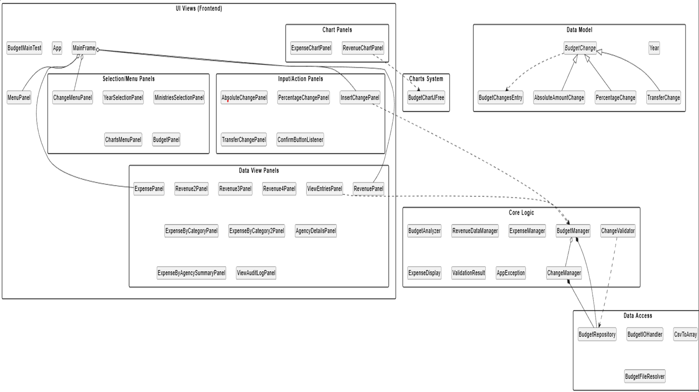

# PRIME MINISTER FOR A DAY

## State Budget Management System

This application is a comprehensive information system developed in **Java Swing** for monitoring, analyzing, and modifying the Greek state budget data for the year 2025. It enables hierarchical navigation through revenues and expenses, as well as the execution of change simulations via fund reallocation.

## Architecture & Design Patterns

* **MVC (Model-View-Controller):** Complete separation of data (CSV), interface (Panels), and control logic (Managers).
* **Command Pattern:** Each modification (BudgetChange) is treated as an autonomous object, enabling Undo/Redo operations and history tracking.
* **Facade Pattern:** The ChangeManager class simplifies communication between the GUI and complex financial operations.
* **Hierarchy Pattern:** Management of revenues across 4 levels (from 2-digit to 7-digit codes) with strict validation of parent-child relationships.

### UML Diagram
The UML diagram captures the class structure and their interactions:

## Data Structures & Algorithms

* **ArrayList:** Used for managing and dynamically filtering search results.
* **Drill-down Algorithm:** Hierarchical navigation through revenue files via RevenueDataManager and ExpenseManager.
* **Validation Logic:** Utilization of ChangeValidator to ensure financial rules (e.g., prevention of negative balances).

## Repository Structure

* `src/main/java/auebprogramming/`: Application source code.
* `src/test/java/auebprogramming/`: Test classes (Unit & Integration Tests).
* `src/main/resources/`: CSV data files (2025) and saved scenarios.
* `docs/diagrams/`: Technical UML diagrams (umlDiagram.puml).
* `pom.xml`: Maven configuration and dependencies (JFreeChart, JUnit 5).

## Class Documentation

### 1. Interface Layer (GUI Layer - Panels)
* **MainFrame.java:** The central frame of the application managing screen transitions via CardLayout.
* **RevenuePanel.java (1, 2, 3, 4):** A series of panels (Revenue2Panel, Revenue3Panel, etc.) implementing the revenue hierarchy drill-down.
* **ViewEntriesPanel.java:** A panel displaying current budget entries in a table format.
* **PercentageChangePanel.java & TransferChangePanel.java:** Specialized input forms for performing percentage-based changes and fund transfers.
* **ViewAuditLogPanel.java:** Screen for viewing the action history (audit log).

### 2. Data & Display Management
* **BudgetChangesEntry.java:** The core entity representing a budget line (Code, Description, Amount).
* **ExpenseManager.java + RevenueDataManager.java:** Handle the loading of revenue and expense CSVs and the validation of their hierarchical structure.
* **BudgetRepository.java:** In-memory data store for fast access and processing of entries.

### 3. Business Logic (Changes)
* **BudgetChange.java (Abstract):** The base for all change commands (Absolute, Percentage, Transfer).
* **ChangeManager:** A simplified interface for executing absolute and percentage change operations, as well as transfers.
* **ChangeValidator.java:** A validity checker ensuring changes do not violate financial rules (e.g., avoiding negative balances).
* **BudgetIOHandler:** Facilitates the conversion of data from files into dynamic data structures for reallocation operations.

## Key Features
1. **Hierarchical Navigation:** Revenue reporting using hierarchical drill-down navigation.
2. **Dynamic Changes:** Support for absolute, percentage changes, and transfers between codes.
3. **Audit Logging:** Full recording of every modification (absolute, percentage, transfer) for transparency purposes.

---

## User Manual

The application provides a user-friendly environment for full state budget management. Follow these steps for navigation:

### 1. Main Menu
Upon startup, the following basic options are available:
* **View Budget:** For detailed browsing of financial data.
* **Insert Change:** For performing simulations and reallocations.
* **View Charts:** For data visualization.

### 2. Data Selection (Revenue/Expense)
Before any operation, select the data type you wish to manage (e.g., **Revenue** or **Expense**).

### 3. Navigation & Drill-down
* View data in table format with corresponding **Codes**, **Categories**, and **Amounts**.
* Select specific 2-digit codes for further hierarchical analysis (Drill-down) by clicking the input button at the top and typing in the search bar.

### 4. Editing Operations
In the "Select Operation" menu, you can perform:
* **Amount Change (Absolute/Percentage):** Modification of specific codes.
* **Fund Transfer:** Moving credits between different categories.
* **Undo:** Canceling the last change.
* **Save/Load:** Managing your scenarios in CSV files.

### 5. Visualization (Charts)
Select the desired chart type:
* **Revenue Chart by Category.**
* **Expense Chart by Agency.**

---

## Build & Run Instructions

### Requirements
* **Java JDK 17** or newer.
* **Maven 3.6** or newer.

### Data Setup
Ensure all `.csv` files are located in the `src/main/resources` folder.

### Run
You can run the application via the generated JAR:

mvn clean package

java -jar target/budget-management-2.0.jar

### Technical Documentation & Quality

Unit Testing: Extensive coverage with JUnit 5 and Mockito (see src/test/java folder).

Static Analysis: Compliance with Checkstyle and SpotBugs rules (via Maven plugins).

JavaDoc: Full code documentation available in public methods and package-info.java.

Precision: Use of the BigDecimal class for absolute precision in financial calculations.

Extensibility: The architecture allows for easy addition of new panels and features.
